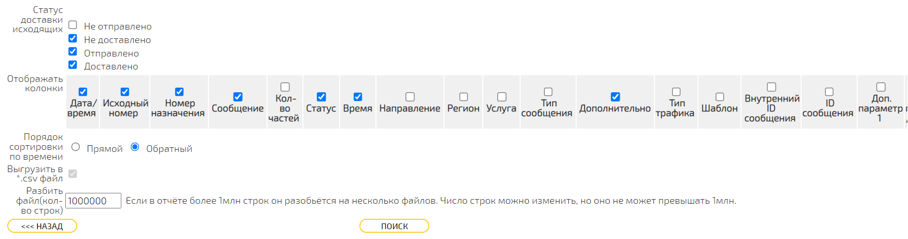

SMPP
====

`Введение`
----------

-----

SMPP - Short Message Peer to Peer

-----

Версия SMPP: `3.4 <https://smpp.org/SMPP_v3_4_Issue1_2.pdf>`_.

-----

SMPP-интеграция позволяет Партнёрам отправлять сообщения пользователям и получать ответные сообщения, а также следить за статусами отправленных сообщений.

В данном документе приведена следующая информация по SMPP-интеграции:

- данные, необходимые для настройки сервиса;
- параметры сообщений различных типов;
- настройки доотправки сообщений различных типов;
- информация о методах получения статусов сообщений.

Поддерживаются следующие типы сообщений:

- SMS;
- FlashingCall (Voice Code);
- Push;
- Viber;
- VK.

`Глава 1`
---------

`Таблицы`
~~~~~~~~~

.. csv-table:: Таблица 1 - Значение возвращаемых ошибок
   :header: "Код ошибки", "Описание ошибки"
   :widths: 10, 15
   
   "0x00", "Успешная аутентификация"
   "0x0F", "Неверный идентификатор сервиса (логин)"
   "0x0E", "Неверный пароль"
   "0x05", "Превышен лимит количества одновременно доступных активных соединений с сервером"
   "0x0D", "Попытка соединения с неразрешенного IP-адреса"

`Рисунки`
~~~~~~~~~

   Рисунок 1.

   Пример сформированного отчета

.. image:: /_static/pic_1.png
   :scale: 30 %
   :align: center
   :alt: Альтернативный текст: Пример сформированного отчета

   Рисунок 2.

   Пример сформированного отчета 2

   Картинка 2

       Иконка

Вставка изображения между слов |иконка| осуществяется с помощью функции автозамены.

.. |иконка| image:: _static/icon.ico
   

`Вкладки`
~~~~~~~~~
Тут, значит, полезный текст, а ниже вкладки.

.. tab-set::
    
   .. tab-item:: Картинки
           
      Тут будут картинки.

   .. tab-item:: Код
      
       Тут будут блоки кода.

   .. tab-item:: Таблицы

      Тут будут таблицы.
      
   .. tab-item:: Вложенные вкладки
      
      Тут будут вложенные вкладки.

       
{#
примечание: это закомментировано, пока не используется
    
        ...
    
#}

