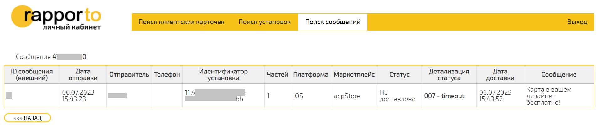

SMPP
====

`Введение`
----------

-----

SMPP - Short Message Peer to Peer

-----

Версия SMPP: `3.4 <https://smpp.org/SMPP_v3_4_Issue1_2.pdf>`_.

-----

SMPP-интеграция позволяет Партнёрам отправлять сообщения пользователям и получать ответные сообщения, а также следить за статусами отправленных сообщений.

В данном документе приведена следующая информация по SMPP-интеграции:

- данные, необходимые для настройки сервиса;
- параметры сообщений различных типов;
- настройки доотправки сообщений различных типов;
- информация о методах получения статусов сообщений.

Поддерживаются следующие типы сообщений:

- SMS;
- FlashingCall (Voice Code);
- Push;
- Viber;
- VK.

`Глава 1`
---------

`Таблицы`
~~~~~~~~~

.. csv-table:: Таблица 1 - Значение возвращаемых ошибок
   :header: "Код ошибки", "Описание ошибки"
   :widths: 10, 15
   
   "0x00", "Успешная аутентификация"
   "0x0F", "Неверный идентификатор сервиса (логин)"
   "0x0E", "Неверный пароль"
   "0x05", "Превышен лимит количества одновременно доступных активных соединений с сервером"
   "0x0D", "Попытка соединения с неразрешенного IP-адреса"

`Рисунки`
~~~~~~~~~

.. figure:: _static/pic_1.png
   :scale: 100 %
   :align: center
   :alt: Альтернативный текст: Пример сформированного отчета

   Рисунок 1.

   Пример сформированного отчета

.. image:: /_static/pic_1.png
   :scale: 30 %
   :align: center
   :alt: Альтернативный текст: Пример сформированного отчета

   Рисунок 2.

   Пример сформированного отчета 2

`Вкладки`
~~~~~~~~~
Тут, значит, полезный текст, а ниже вкладки.

.. tab-set::
    
   .. tab-item:: Картинки
           
      Тут будут картинки.

   .. tab-item:: Код
      
       Тут будут блоки кода.

   .. tab-item:: Таблицы

      Тут будут таблицы.
      
   .. tab-item:: Вложенные вкладки
      
      Тут будут вложенные вкладки.

         
         
.. tabs::

    .. tab:: SMS

      {
        "login":"ВАШ_ЛОГИН",
        "password":"ВАШ_ПАРОЛЬ",
        "useTimeDiff":true,
        "id":"8770630",
        "shortenLinks":false,
        "scheduleInfo":{
          "timeBegin":"10:00",
          "timeEnd":"12:00",
          "weekdaysSchedule":"123"
        },
        "destAddr":"Номер_Абонента",
        "message":{
          "type":"SMS",
          "data":{
            "text":"Текст. Follow link: <http://verylongurl.com/very/long/url>",
            "serviceNumber":"НОМЕР_ОТПРАВИТЕЛЯ",
            "ttl":10
          }
        }
      }

    .. tab:: Viber-сообщение (текст + изображение + кнопка)

      Поддерживаются следующие варианты Viber-сообщений:

      * только текст (в InstantContent задаётся атрибут type = TEXT);

      * только изображение (в InstantContent задаётся атрибут type = IMAGE_URL);

      * текст, изображение, кнопка для перехода (в InstantContent задаётся атрибут type = BUTTON с текстом сообщения, адресом изображения, наименованием кнопки и URL для перехода).

      {
         "login":"ВАШ_ЛОГИН",
         "password":"ВАШ_ПАРОЛЬ",
         "useTimeDiff":false,
         "id":"8770100",
         "scheduleInfo":
         {
            "timeBegin":"10:00",
            "timeEnd":"20:00",
            "weekdaysSchedule":"12345"
         },
         "destAddr":"Номер_Абонента",
         "message":
         {
            "type":"VIBER",
            "data":
            {
               "instantContent":
               {
                  "type":"BUTTON",
                  "data":
                  {
                     "text":"VIBERMESS",
                     "imageURL":"https://example.ru/image",
                     "caption":"ПЕРЕЙТИ",
                     "action":"https:// example.ru/image"
                  }
               },
               "serviceNumber":"НОМЕР_ОТПРАВИТЕЛЯ",
               "ttl":1
            }
         }
      }

Вставка картинки
----------------

       Подпись изображения

Картинка 2

.. figure:: _static/icon.png
       :scale: 50 %
       :align: center

       Иконка

Вставка изображения между слов |иконка| осуществяется с помощью функции автозамены.

.. |иконка| image:: _static/icon.ico
